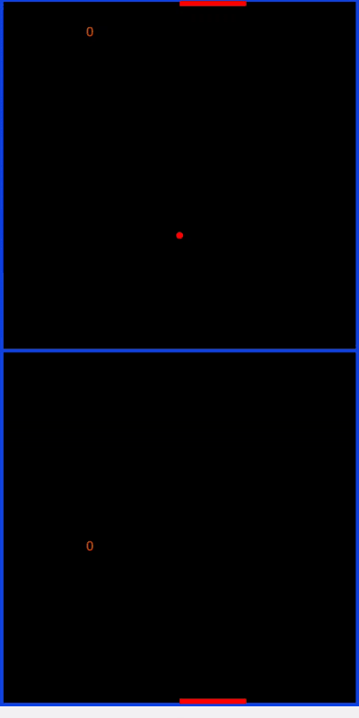

# Pong Game Mobile App With Kivy

> This is basic pong game using python and kivy.

## Installation

You can download apk file in `bin\pongGame.apk` to your phone or tablet. Or you can clone the repo in pc.

## Usage

For pc , you can run the game with :
`python main.py` in cmd.

Then you can play the game with touching/clicking.

Have a nice try!

If you run into a problem, you can let me know here or on my Twitter account. - [@Mehmetkaragoz07](https://twitter.com/Mehmetkaragoz07) - karagoz.mhmtg@gmail.com

https://github.com/mehmet-karagoz